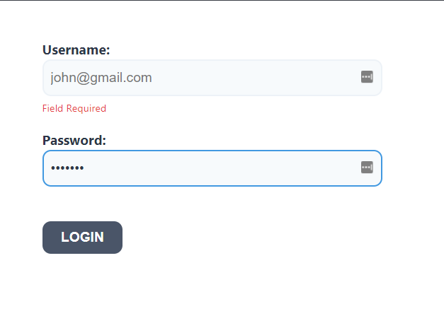

# Formik Login Form

## Description

This is a simple React login form built using <a href="https://formik.org/">formik</a>. It showcases form validation using formik.

All styling used comes from Formik's <a href='https://formik.org/docs/tutorial#setup-option-2-local-development-environment'>tutorial style files </a>

## How to Run

This project was created using Create React App.

Check it out on a <a href='https://codesandbox.io/s/github/waleedalrawi/formik-form'>sandbox here!</a>

To run locally, download the repository, navigate to it in your terminal, and run:

### `npm start`

which runs the app in the development mode.

Open [http://localhost:3000](http://localhost:3000) to view it in your browser.

## Roadmap of Future Improvements

Write reusuable input primitive components to encapsulate the label, field, and error <a href ='https://formik.org/docs/tutorial#leveraging-react-context
'>using formik's usefield()</a>.

## License

MIT license - see license file.
